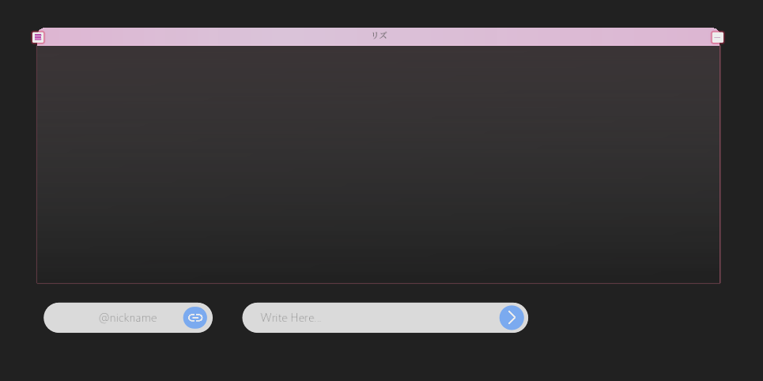

# Augma Link

Augma Link is a project that attempts to recreate the interface and functionality of the movie *Sword Art Online: Ordinal Scale*, with icons and functionality created with GDScript. using [Redot Engine](https://www.redotengine.org) as the main engine.

# Applications

Augma Link (Ordina Scale UI) has some applications made in GDScript, but some require attention to run.

> [!WARNING]
> Applications are not finalized yet

## Chat Application
The chat is not fully implemented with the program. But it is functional with a mosquitto server.

I recommend that you edit the addresses before running.

To connect to the server, edit the "Nickname" and click "Connect" to start `mosquitto` connection.

> [!IMPORTANT]
> This application is still under testing, and is not 100% functional. I would be very grateful if you could report any errors or suggestions for changes to the code.

## Music Application
It's a simple application without many features. Made only for MP3 testing purposes.

# Android support
Augma Link was propused to run on android devices.
There's a script attached to Camera3D, it collects _magnometer_ and _gyroscope_ data and send it to the camera rotation.

It was made thanks to [this tutotrial](https://github.com/ramatakinc/mobile-sensors-tutorial) from [ramatakinc](https://github.com/ramatakinc).

# Icons and Textures

Some icons for this project were found on Google Fonts, and the icons related to SAO OS I recreated myself using inkskape 

 

these are some examples of what inkscape can do.
 

# Addons

I used some addons that I believe helped me a lot in what I wanted to do.
They are:

> [TextureRectRounded](https://godotengine.org/asset-library/asset/2591) (kuruk-mm)

> [godot-mqtt](https://github.com/goatchurchprime/godot-mqtt) (goatchurchprime)

# Disclaimer

This project is an unofficial recreation of the user interface from the **Augma** device featured in the movie *Sword Art Online: Ordinal Scale* (© Reki Kawahara / A-1 Pictures / Aniplex).

All rights related to the original design, names, trademarks, and visual elements belong to their respective owners.

This project is created **for educational and fan purposes only**, with no commercial intent.  
It is not affiliated with the *Sword Art Online* franchise, its creators, or its distributors in any way.

If you are a legal representative and wish to request removal or modification of any content, please contact us through the [Issues](../../issues) tab of this repository.
